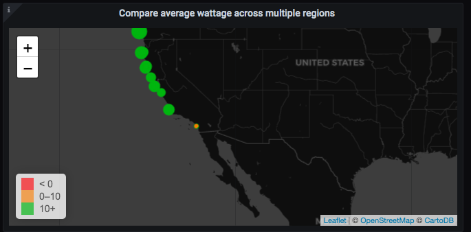
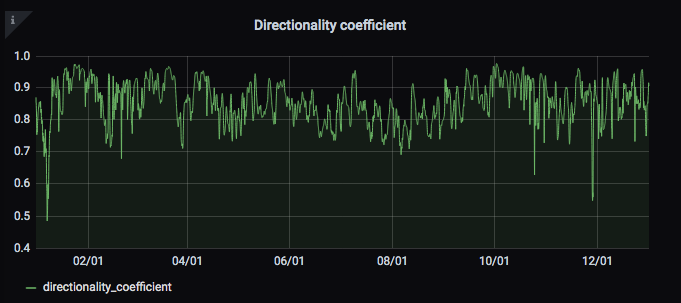
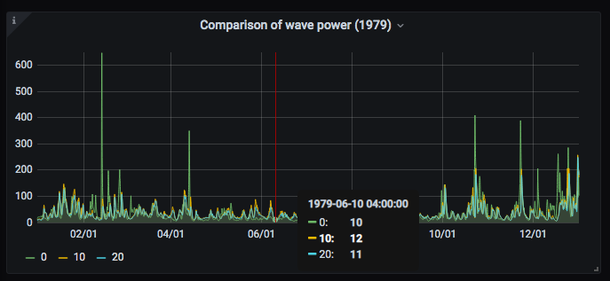

# WaveQ

A platform for easily visualizing and querying wave data to inform deployment of wave energy converters. 

## Table of contents
* [Overview](#Overview)
* [Examples](#Examples)
* [Tech Stack](#Tech-Stack)
* [Cluster Setup](#Cluster-setup)

## Overview

Utility companies wanting to deploy wave energy converters need query-able wave data. Good 
wave data can inform where to place a wave energy converter. Wave data also helps monitor 
and predict wave conditions for wave energy converters. 

In August 2020, the Department of Energy (DOE) released a 2.7TiB wave hindcast and buoy data 
set containing wave characteristics along the Exclusive Economic Zone (EEZ) on the US west coast. 
Details regarding the data can be found on AWS(insert link) and the data's GitHub ReadME(insert link).
Data contain high resolution (up to hourly) read outs from over 600,000 points on the EEZ part of 
the US west coast and cover over 10 different wave variables. 

Performing analyses on the data is currently difficult. Data is divided into yearly files
in an H5 format. Variables are divided into data sets within each H5 file, and performing 
queries and visualizations without in depth knowledge of the H5 file format is almost impossible.

WaveQ offers an intuitive solution - an intuitive visualization platform with querying capabilities.

## Examples 

Analysts and data scientists benefit from interacting with data in two ways - querying 
and visualizing. 

### Querying

Pick a time table from the database.

Choose metrics. 

Download your data.

### Visualizing 

Pick a table from the database.

Specify time series as the query option.

Visualize the metric of interest across time.

Compare various locations easily.

## Tech Stack

1. AWS S3 service stores raw data from the DOE.
2. PySpark reads in data and performs processing on data.
3. Data gets stored in TimescaleDB.
4. Grafana interacts with TimescaleDB to allow for easy visualization and querying.

## Cluster Setup

I used AWS's EC2 service to create virtual instances. All instances were t2.large running
on Ubuntu 20.04. I deployed a Spark cluster of three workers and one driver node. The driver 
node connected to a separate TimescaleDB instance. A separate Grafana instance then connected 
to TimescaleDB. 

***Note: If trying to setup a similar pipeline on AWS, ensure all instances share communication permissions
with a security group.*** 

